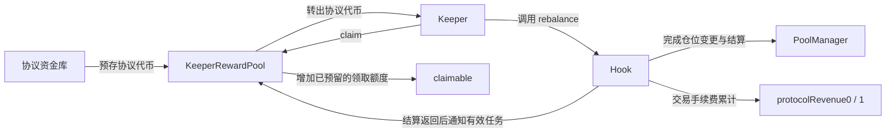

> **档案。** 本文对应已移除的实现(共享流动性金库与 keeper 奖励池),仅供理解设计背景,**不能作为当前代码的结论**。当前行为见 [SPEC](../../SPEC.md),移除原因见 [审查记录](../../REVIEW-2026-09-13.md)。文中指向源码或测试的链接可能已失效。

# 历史归档：2026-09-13 奖励池设计草案

> 本页保留最初设计草案全文。原文“尚未实现”的状态已经过期，具体提案也不应当作现行接口。
>
> 当前独立奖励池已经实现，详见 奖励池说明(奖励池文档,已随 keeper 移除)。例如原稿提议的盈余回收没有实现：直接转入但未通过 fund 记账的代币，当前没有专用回收入口。以下原文不作追溯修改。

---

# Keeper 协议代币奖励池设计草案

日期：2026-09-13。状态：仅设计，尚未实现，也不代表经济安全已验证。

用户已确定：keeper 奖励采用协议代币；代币尚未创建；先设计预存 ERC20 的独立奖励池。
本文给出建议的第一版，奖励金额、预算、冷却时间和具体代币仍待确定。现有
`SPEC.md` 描述当前实现，本文不修改它，也不覆盖工作区其他正在进行的修复。

## 1. 资金与职责

协议提前向 `KeeperRewardPool` 充值协议代币。Hook 在完成符合条件的维护后通知奖励池，
奖励池预留对应代币并记入 keeper 的可领取余额。keeper 可累计后单独领取。



两个账本有独立职责：

| 账本 | 持有资产 | 支出用途 |
| --- | --- | --- |
| Hook 的 `protocolRevenue0/1` | 各池 token0、token1 | 协议收入提取 |
| `KeeperRewardPool` | 指定的协议 ERC20 代币 | 已确认的 keeper 奖励、未承诺资金的回收 |

奖励池没有铸币权限，不向 Hook 提取协议收入，不读取交易池现价兑换奖励数量。
即使协议代币恰好也是某个交易池的资产，奖励资金仍保存在独立合约内。

## 2. 第一版奖励什么

建议第一版只奖励有效的公开 `rebalance`。`pokeFee` 保留刷新功能，先不设代币奖励：
当前 `beforeSwap` 已会在缓存过期时刷新费率，单独付费的必要性应另行验证。
这是草案建议，不是用户已经确定的业务规则。

有效调仓必须满足：

1. 该 `PoolId` 已由奖励管理员明确启用并分配预算。池子初始化成功不等于获得补贴资格。
2. 执行前存在实际活动仓位，实际价格已越出旧区间；不能只相信 `needsRebalance` 标记。
3. 旧仓位撤出、新仓位建立、资产结算均成功，最终活动流动性大于零，最终价格在新区间内。
4. 仓位确实发生了符合上述条件的变更；无操作返回、仅清理标记、资金停入 idle 均不奖励。
5. 这是公开 keeper 路径。存取款内部触发的维护不奖励。

奖励的是 Hook 验证的状态变化，调用者不能提交“完成了多少工作”或奖励数量。
keeper 地址取自公开入口的 `msg.sender`；若经路由合约调用，该路由合约就是收款方，
第一版不根据 `tx.origin` 或任意 calldata 推断另一个收款人。

当前 `_doRebalance` 的 `true` 同时覆盖真实重建仓位、没有活动流动性、全部转入 idle 等情况。
实施时必须返回明确的执行结果，不能直接把现有布尔返回值当作领奖依据。

## 3. 奖励数量和预算

每个获准池配置一次有效调仓的固定奖励 `r`，单位为协议代币最小单位。
奖励额度不再按 `protocolRevenue` 的百分比计算；固定数量也不承诺覆盖实时 gas 成本。

同时设置三个限制：

| 参数 | 含义 |
| --- | --- |
| `globalEpochCap` | 全部池在一个固定 UTC 日内最多记入的奖励总量 |
| `poolEpochCap[id]` | 一个池在该 UTC 日内最多记入的奖励总量 |
| `minRewardInterval[id]` | 一个池两次成功记入奖励之间的最短间隔，与 keeper 地址无关 |

只有固定奖励 `r` 能被全部资金和预算覆盖时才记账。余额不足、预算耗尽、未启用、
处于奖励冷却期时返回零奖励，调仓仍可完成。第一版不部分发奖，不记无资金支持的欠条。
未获得奖励的历史任务不因后来充值或预算刷新而补发。

预算按**记入可领取余额的时刻**扣减，而不是按实际领取时刻扣减。否则 keeper 延迟领取
即可绕过预算。每日计数懒更新，不遍历所有池，不要求每天有人执行重置交易。
未用额度不滚入下一日；充值只增加资金，不增加每日额度，也不重置已用额度。

固定 UTC 日并非任意滚动 24 小时：日期边界前后可能分别使用两天额度。每池冷却仍跨日
连续生效；全局预算如需约束任意滚动窗口，需改用其他限速模型，不能把本规则宣传成该保证。

参数调整在下一 UTC 日生效，当前日已用额度、已记账权益和奖励冷却时间不得被配置操作清空。
应急暂停可立即停止新增奖励，已记入的奖励继续允许领取。
初始奖励和预算为零，默认关闭激励；本文不替用户设定发行量或发放速度。

## 4. 任务唯一性与防刷边界

Hook 为每次符合条件的公开调仓生成每池单调递增的 `workNonce`。
奖励池只接受固定 Hook 的通知，按 `PoolId + workNonce` 去重；用户不能自己登记任务。
Hook 在外部通知前完成任务编号更新，奖励池不允许回放旧编号。
任务只在完成时尝试一次，冷却或资金不足不会留下以后可以兑换的任务票据。

只靠“确实完成调仓”、任务编号、冷却和预算，**不能证明无法套利刷奖**。
交易者可以同时是 LP 和 keeper，自己推动价格，再执行一次真实调仓。
这些限制分别解决伪造、重复支付、领取速率和资金支出上限，无法识别交易者的经济动机。
获准池也可能被这样操作，不能把池白名单当成完整的经济防线。

上线前须针对拟启用的池评估：

- 自持外部流动性、循环推动价格并领取奖励后，完整退出的净收益；计入所有交易、持仓与 gas 成本。
- 多个 keeper 地址轮换、多个获准池轮换、跨日执行，是否突破约定的支出约束。
- 协议代币价格上涨、池深度下降时，固定奖励是否变得比制造调仓条件的成本更高。
- 合法维护所需成本是否高于奖励价值，导致无 keeper 愿意执行。

如无法形成可接受的激励参数，应保持对应池奖励关闭，再调整触发条件或奖励机制。
预存池能限制资金来源；即便最坏损失有上限，预算被刷完仍会使真正维护者失去激励。

## 5. 领取与资金不变量

奖励池维护 `claimable[keeper]`、`totalClaimable` 和 `available`：

```text
totalClaimable = 所有 keeper 的 claimable 之和
accountedFunds = available + totalClaimable
rewardToken.balanceOf(rewardPool) >= accountedFunds
```

上述偿付约束依赖所选代币不会在没有本合约转账的情况下扣减余额。
第一版选用固定单位的普通 ERC20，不支持转账扣税、余额重定价或任意外部扣款的代币。
有暂停或黑名单权限的代币可能暂停领取，不能声称奖励一定随时可兑付。

- `fund(amount)`：使用安全转账并核对实际到账；要求精确到账，成功后增加 `available`。
- 记奖：`available -= r`，`totalClaimable += r`，`claimable[keeper] += r`。
  这个路径只做本地记账，不调用代币的 `balanceOf`、转账或价格预言机。
- `claim(recipient)`：领取者只能花自己的余额，先扣账再安全转账，并保护重入。
  转账失败应让该次领取回滚，保留原权益；与先前完成的调仓是不同交易。
- 管理员最多回收 `available`，不能动 `totalClaimable`；回收也先扣账再转账。
- 直接向奖励池转币不会自动增加 `available`。可提供管理员回收未记账额的入口，
  其上限严格为实际余额减去 `accountedFunds`，不能重分类已承诺资金。
- 所有涉及代币调用或管理员资金操作的写入口采用一致的重入保护，不能只保护 `claim`。

安全转账建议复用仓库已固定版本的 OpenZeppelin `SafeERC20`，其作用是处理返回 false
或不返回布尔值的 ERC20 调用；它本身不验证精确到账、代币经济属性或奖励公平性。
参见 [SafeERC20 文档](https://docs.openzeppelin.com/contracts/5.x/api/token/erc20#SafeERC20)。
重入保护可复用仓库现有依赖中的 `ReentrancyGuard`，同时坚持先更新账本再外部调用。
参见 [ReentrancyGuard 文档](https://docs.openzeppelin.com/contracts/5.x/api/utils#ReentrancyGuard)。

## 6. 故障隔离与连接方式

建议流程：

```text
rebalance(key)
  -> PoolManager.unlock(...)
  -> 回调完成旧仓位撤出、换币、新仓位建立和结算
  -> unlock 返回明确执行结果
  -> Hook 消耗本次 workNonce
  -> 限制 gas、限制返回数据大小，尝试奖励池记账
  -> 记录已记奖或未记奖的事件
```

奖励池通知应移出 `_doRebalance` 的 unlock 回调，在 PoolManager 结算结束后执行。
余额不足、预算耗尽和暂停属于正常的零奖励结果；奖励池异常回滚也不应撤销已完成的维护。
实现需控制转发 gas 和返回数据复制量，并保留调用后的执行 gas；整笔交易本身 gas 不足
仍可能回滚，不能保证任意低 gas 下的成功。
失败通知不产生已承诺的领取额度，也不提供第一版自动重试入口；事件必须明确显示此结果。

`KeeperRewardPool` 固定 `rewardToken` 和授权 `hook`，不提供任意外部调用能力或铸币入口。
Hook 可先部署为奖励未连接状态，再部署绑定该 Hook 的奖励池，最后由管理员一次性连接。
连接时验证代码存在、奖励池声明的 Hook 身份和代币地址；连接状态与奖励启用状态分开。
新部署默认关闭，管理员先充值并为池分配预算后再启用。

第一版连接后不热替换奖励池，不可变更奖励代币；可暂停新增奖励。若需要迁移，旧池仍须
保留 keeper 的领取渠道，另行设计迁移流程，不允许通过更换地址清空债权。
这里描述的是新版本部署方案，不意味着已经部署的不可升级 Hook 可以自动改变逻辑。

## 7. 对当前代码的改动清单

实施时预计新增 `KeeperRewardPool.sol` 及其最小通知接口，并调整：

| 位置 | 预期变更 |
| --- | --- |
| `HookBase.sol` | 去掉协议收入分成、奖励水位；增加一次性奖励池连接状态和任务编号 |
| `RebalanceEngine.sol` | 返回准确执行结果；公开调仓在 unlock 返回后尝试记奖 |
| `FeeModule.sol` | 按本草案第一版建议，移除 `pokeFee` 的收入分成，保留刷新功能 |
| `PulseV4Hook.sol` | 增加一次性连接入口；协议收入提取不再处理奖励水位 |
| 部署脚本 | 处理 Hook 与奖励池的部署次序、连接校验及默认关闭状态 |
| 测试与规格 | 替换原 10% 分成断言，增加奖励记账及故障隔离场景 |

每笔 swap 不增加奖励池调用、奖励余额读取或奖励代币写入。
成本主要落在公开调仓和领取上；预算和领取不遍历池子或 keeper。
实施后仍需重新测调仓 gas、通知所需 gas 上限和 Hook 字节码大小。

现有协议费公式包含与 gas price 相关的收费项，其注释将用途关联到 keeper 激励。
改用协议代币后，应另行决定该收费项是否保留及其经济理由；本文不擅自修改交易费率。
份额稀释、零基础币成交量漏标记 stale、idle 恢复等既有审查问题也不会因此得到修复。

## 8. 实施验收条件

1. 普通调用者、其他 Hook、未获准池不能记奖；空操作、失败、idle、存取款维护无奖励。
2. 同一任务最多一次；轮换地址不会绕过池级冷却；同一任务不会由多个入口重复奖励。
3. 全局和每池的**累计记账额度**均受各自预算约束；延迟 claim 不改变这一约束。
4. 验证 UTC 日边界、冷却边界、配置生效边界以及充值和回收不重置额度。
5. 充值、记奖、领取、回收的随机序列持续满足资金不变量；无法提走他人权益。
6. 奖励池禁用、未连接、无余额、耗尽预算、回滚或消耗通知 gas 时，充足总 gas 下有效调仓仍完成。
7. 代币返回 false、无返回值、扣税、暂停、恶意重入时，账本保持一致，既有仓位不被奖励领取影响。
8. 用真实 PoolManager 复现自交易触发、多个身份配合和完整退出，量化刷奖收益与支出上限。
9. 重跑现有 Hook 集成测试和资金不变量，检查奖励通知前已经完成全部 PoolManager 结算。

此阶段只产出设计。后续需要确定：奖励代币与链、每池奖励 `r`、全局和每池预算、
奖励冷却，以及是否接受第一版只补贴 `rebalance`。这些参数未确定前保持激励关闭。
